# 🚀 LangGraph Project-Based Learning

> **Hands-on LangGraph workflows for developers who already know LangChain**

This repository is a **project-based learning playground** for mastering **LangGraph** — LangChain’s framework for building **stateful, multi-step, agentic workflows**.

Instead of toy demos, this repo focuses on **real, production-style agent systems**:
- Multi-node LLM workflows  
- RAG (basic → advanced)  
- Multi-agent orchestration  
- Memory & persistence (SQLite)  
- HITL (Human-in-the-Loop)  
- Map-Reduce & tool calling  
- End-to-end assistants (Travel, LinkedIn, Finance)

---

## 📑 Table of Contents

1. [Who This Repo Is For](#who-this-repo-is-for)
2. [Repository Structure](#repository-structure)
3. [Course Modules](#course-modules)
   - [Module 1 – LangGraph Basics](#module-1-langgraph-basics)
   - [Module 2 – Memory & Persistence](#module-2--memory--persistence)
   - [Module 3 – RAG with LangGraph](#module-3--rag-with-langgraph)
   - [Module 4 – Tools, HITL & Map-Reduce](#module-4--tools-hitl--map-reduce)
   - [Module 5 – Multi-Agent Systems](#module-5--multi-agent-systems)
   - [Module 6 – Short-Term-Memory](#module-6--short-term-memory)
   - [Module 7 – End-to-End Assistants](#module-6--end-to-end-assistants)
4. [All_Scripts – Production Code](#all_scripts-production-code)
5. [Setup & Run](#setup--run)
6. [What You’ll Master](#what-youll-master)
7. [Author](#author)

---

## Who This Repo Is For

✅ Developers already familiar with **LangChain**  
✅ Engineers exploring **LangGraph for real systems**  
✅ Anyone building **agentic workflows, RAG, or assistants**  
❌ Not meant for absolute beginners

---

## Repository Structure

```
LangGraph_Project_Based_Learning/
│
├── All_Experiment/        # Jupyter notebooks (learning + experiments)
├── All_Scripts/           # Production-style Python scripts
├── faiss_index_financial/ # Vector store for RAG
├── financial_pdfs/        # Financial documents for RAG
├── pdfs/                  # Sample PDFs
├── main.py                # Entry point
└── pyproject.toml
```

---

## Course Modules

## Module 1 - LangGraph Basics

### 1️⃣ `1_simple_llm_workflow.ipynb`
- First LangGraph workflow
- Nodes, edges, state
- Deterministic LLM orchestration

**Workflow Diagram:**  

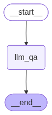

**YouTube:**  
🎬 *LangGraph Basics – Your First Workflow*

---

### 2️⃣ `2_sentiment_review_reply_workflow.ipynb`
- Sentiment-based routing
- Conditional edges
- Real-world decision graphs

**Workflow Diagram:**  

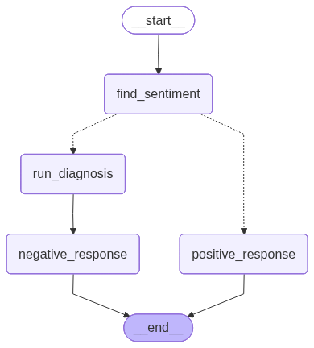

---

## Module 2 – Memory & Persistence

### 3️⃣ `5_Chatbot_with_InMemory_Saver.ipynb`
### 4️⃣ `6_sqlite_saver.py`
### 5️⃣ `7_persistance.ipynb`

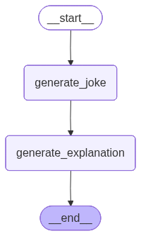


- In-memory & SQLite-based persistence
- Long-running agents
- Conversation history

---

## Module 3 – RAG with LangGraph

### 6️⃣ `3-simple_rag_agent.ipynb`
- Basic RAG pipeline
- Retrieval as a graph node

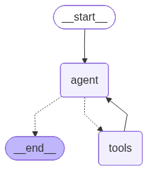

---

### 7️⃣ `13_advance_rag.ipynb`
- Production-grade RAG
- FAISS vector store
- Stateful finance bot

**Workflow:**  
User → Query Rewrite → Retriever → LLM → Memory

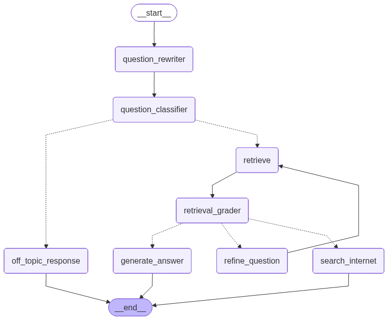


---

## Module 4 – Tools, HITL & Map-Reduce

### 8️⃣ `8_tools.ipynb`
- Tool calling
- Controlled execution

### 9️⃣ `9_HITL.ipynb`
- Human-in-the-loop approvals

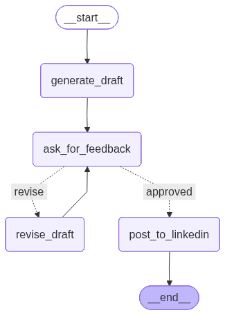

### 🔟 `10_map_reduce.ipynb`
- Parallel map-reduce workflows

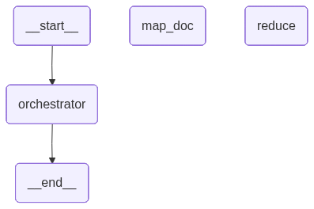

---

## Module 5 – Multi-Agent Systems

### 1️⃣1️⃣ `11_multiagent.ipynb`
- Supervisor & worker agents
- Agent collaboration

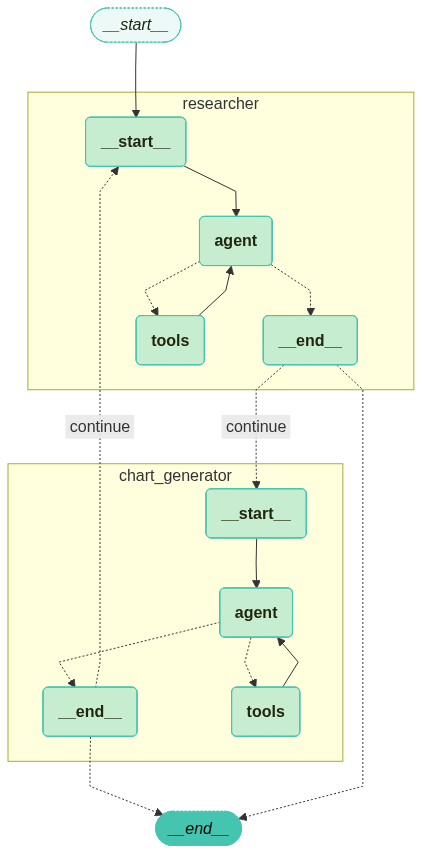

---

---

## Module 6 – Short-Term-Memory

### 1️⃣4️⃣ `11_short_term_memory.ipynb`
- Trimming
- Deletion
- Summarization

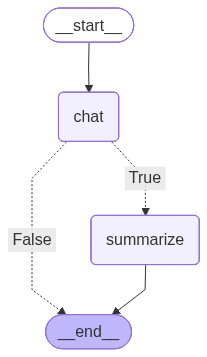


### 1️⃣5️⃣ `10_advance_rag_summary_coversation.ipynb`
- Advance RAG with Summarization node

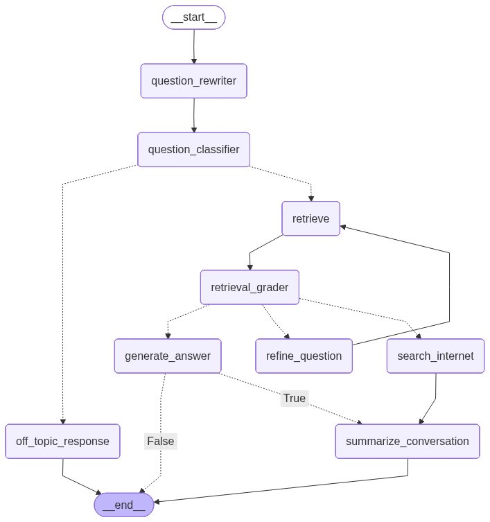

---

## Module 7 – End-to-End Assistants

### 1️⃣2️⃣ `12_travel_assistant.ipynb`
- Travel planning assistant
- Tools + memory + reasoning

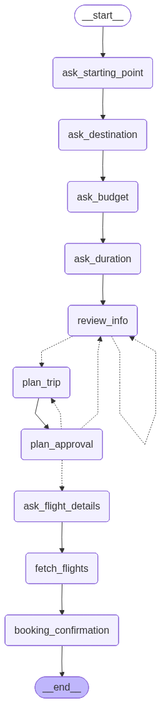

**YouTube:**  
🎬 *Building a Travel Assistant with LangGraph*

---

## All_Scripts Production Code

```
All_Scripts/
├── Advance_RAG/
├── Linkedin_Post_Generator/
├── Travel_Assistant/
```

- Script-based, deployable implementations
- Backend-ready LangGraph agents

---

## Setup & Run

### Installation

```bash
git clone https://github.com/SachinMishra-ux/LangGraph_Project_Based_Learning
cd LangGraph_Project_Based_Learning
```

### Run Notebooks
```bash
jupyter notebook
```

### Run Main App
```bash
python main.py
```

---

## What You’ll Master

✔ LangGraph mental model  
✔ Agentic workflows  
✔ RAG systems  
✔ Multi-agent orchestration  
✔ Memory & persistence  
✔ HITL pipelines  
✔ Production-ready AI agents  

---

## Author

**Sachin Mishra**  - sachin19566@gmail.com

- Building real-world GenAI/AgenticAI systems with LangGraph 🚀
